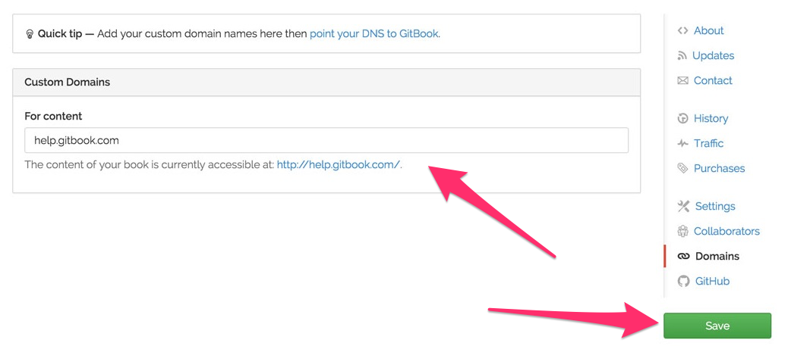

# 사용자 지정 도메인

**Gitbook.com** 의 모든 책은 `http://{author}.gitbooks.io/{book}/` 에서 제공됩니다. 책의 내용은 `http://{author}.gitbooks.io/{book}/content/` 에서 확인할 수 있습니다.

하지만 사용자 정의 도메인 이름으로 책을 구성할 수 있습니다 (GitBook 의 무료 기능). 도메인 이름은 홈페이지 또는 컨텐츠 (또는 모두) 에 사용될 수 있습니다.

사용자 지정 도메인 추가하는 것은 간단합니다.

### GitBook.com 에서

책의 **Settings** 탭으로 가서 **Domains** 를 누르세요. 간단하게 도메인을 입력하고 저장하세요.



### 도메인 등록기관에서

설치를 완료하려면 도메인 등록 기관에서 몇가지 변경을 해야 합니다:

1. 도메인 등록 기관에 로그인하고 호스트 레코드를 추가/편집할 수 있는 페이지를 찾으세요. 그 페이지는 종종 설정의 `Edit DNS`, `Host Records`, `Zone File Control` 아래에서 찾을 수 있습니다.

2. `www` 레코드를 **CNAME** 으로 설정하고 URL 필드를 다음과 같이 설정하세요: ```www.gitbooks.io```.

3. 기본 도메인 (`yourdomain.com`) 을 `www.yourdomain.com` 에 리디렉션 하려면, *"도메인 포워딩"* 을 사용하도록 설정해야합니다. 이것은 종종 'Forwarding', 'URL Forwarding', 'URL Redirect' 아래에서 찾을 수 있습니다.


이게 전부입니다 ! DNS 전파에는 몇시간이 걸릴 수 있습니다.
