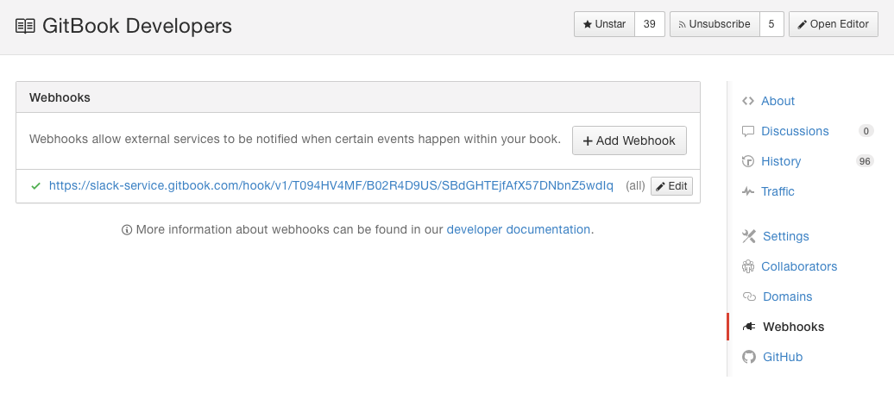

# 웹훅

웹훅은 책에 특정 작업이 발생할 때 외부 웹서버로 알림을 전달하는 방법을 제공합니다.

웹훅은 책에 다양한 작업이 수행될 때마다 촉발될 수 있습니다.

새 웹훅을 설정하기 위해 외부 서버에 접근해야하고 기술적인 절차에 익숙해야 합니다. 웹훅 구축에 도움을 얻으려면, 연결할 수 있는 작업의 전체 목록을 포함하고 있는 [개발자 안내서](http://developer.gitbook.com/webhooks/index.html)를 방문하세요.

### 새로운 웹훅 구성

책 설정에서 직접 웹훅을 구성할 수 있습니다:

